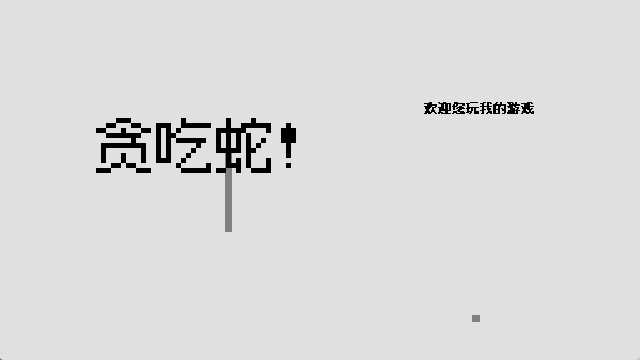

# SnakeProject - 基于 SDL2 的贪吃蛇游戏

**SnakeProject** 是一款使用 **C++** 与 **SDL2 / SDL2_ttf** 开发的桌面端贪吃蛇游戏，支持中文界面、可配置玩法、本地排行榜和一键打包发布。



## 功能特点

* 支持窗口模式和全屏模式
* 支持可切换、可扩展的自定义配色方案
* 支持游戏参数调整：地图大小、游戏速度、初始蛇身长度、是否无边界
* 支持三种游戏模式：训练模式、生存模式、障碍模式
* 生存模式会在吃到食物后逐步提升速度，并带有倒计时压力
* 障碍模式会随机生成障碍物，撞到障碍会结束游戏
* 支持本地最高分排行榜，按模式分别保存 Top 10 记录
* 支持一键启动和一键发布打包

## 快捷启动

Windows 下可以直接双击仓库根目录中的：

```bat
start-game.cmd
```

脚本会自动执行 `Debug|x86` 构建，复制运行所需的 DLL 与资源文件，然后启动游戏。

## 一键发布

执行：

```bat
build-release.cmd
```

脚本会自动构建 `Release|x86` 版本，并生成：

* `dist\SnakeProject\`：完整可运行发布目录
* `dist\SnakeProject.zip`：可直接分发的压缩包

如果只想生成发布目录、不生成 zip，可以执行：

```bat
build-release.cmd --no-zip
```

## 最高分

游戏结束后会自动记录本局分数。排行榜按游戏模式分别保存，每个模式保留前 10 名。

记录文件位于运行目录下：

```text
user\highscores.tsv
```

主菜单中的“最高分”页面可以查看、切换模式和清空当前模式记录。

## 手动构建

1. 克隆本仓库；
2. 在 Visual Studio 中打开 `MSVS\snake1.sln`；
3. 选择 `x86` 平台；
4. 构建项目；
5. 将 `external\lib\x86` 中的 DLL 文件复制到输出目录；
6. 将 `MSVS\assets` 文件夹复制到输出目录；
7. 运行 `snake!.exe`。

## 项目状态

项目已完成中文界面、本地排行榜、多模式玩法扩展和 Windows 一键打包发布流程。
